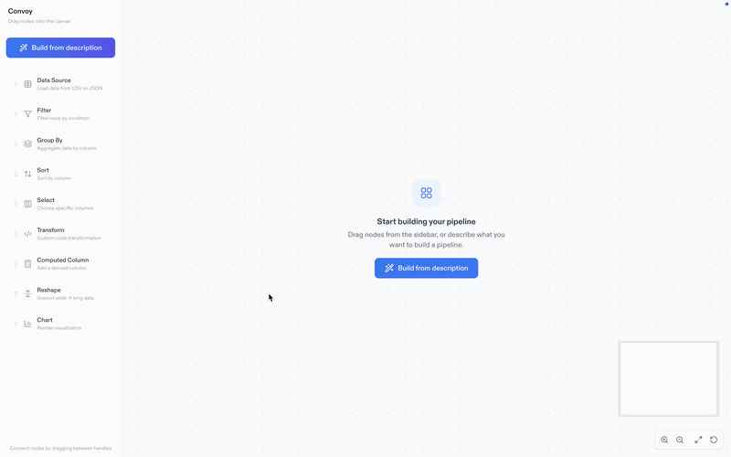

# Convoy

Convoy is a canvas-based data visualization tool that helps you build and run data pipelines through an interactive node graph. You connect data sources to filter, transform, group, and chart nodes, with optional AI-assisted pipeline suggestions powered by Anthropic. The tool supports exporting pipelines to Python scripts and Jupyter notebooks.

<p align="center">
  
</p>

## Prerequisites

Before you begin, ensure you have the following installed:

- Node.js (v18 or later)
- npm (v9 or later)
- **Chart preview (optional):** Python 3 with matplotlib. In-app chart preview is rendered by the backend; without Python/matplotlib the chart area will show an error. Install with:

  ```bash
  pip install -r server/scripts/requirements.txt
  ```

  There is no client-side fallback for charts.

## Local Development

1. **Clone the repository:**

   ```bash
   git clone https://github.com/yourusername/convoy.git
   cd convoy
   ```

2. **Install dependencies:**

   ```bash
   npm install
   ```

3. **Create a `.env` file in the root directory and add your Anthropic API key (optional, for AI features):**

   ```bash
   ANTHROPIC_API_KEY=your_api_key_here
   ```

4. **Start the development server:**

   ```bash
   npm run dev
   ```

5. **Open http://localhost:5173 in your browser to see the application.**

## Available Scripts

- `npm run dev` - Start the development server (Vite + API server)
- `npm run dev:client` - Start only the Vite dev server
- `npm run dev:server` - Start only the API server
- `npm run build` - Build the application for production
- `npm run preview` - Preview the production build locally
- `npm run lint` - Run ESLint to check for code issues
